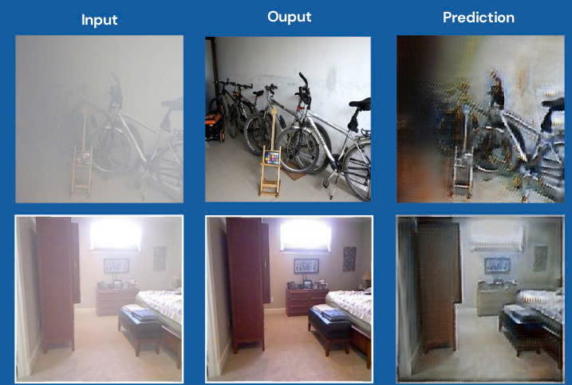
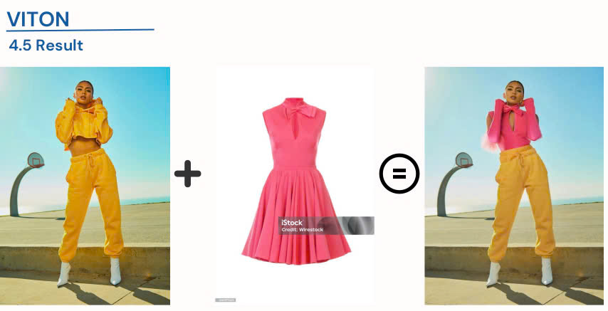

# Image Dehazing and Virtual Try-On

This project implements two advanced deep learning applications:

1. **Image Dehazing with CycleGAN**: Using CycleGAN, this module removes haze from images, enhancing visual clarity in outdoor scenes by translating hazy images into clean, dehazed versions.
2. **Virtual Try-On with VITON**: Leveraging the VITON architecture, this module allows users to try on clothing virtually by aligning and blending target clothing items onto a provided person’s image, creating a realistic try-on experience.

## Technologies Used
- **CycleGAN**: Used for the dehazing task, translating hazy images to clear images.
- **VITON**: Used for the virtual try-on task, aligning clothing images with a person’s body for a seamless try-on effect.

## Results

### Image Dehazing

  
### Virtual Try-On

### [Video](https://drive.google.com/file/d/1wh_bNCSaD7WTPXNuA14XUg5_dOQDMGzl/view?usp=drive_link) 
